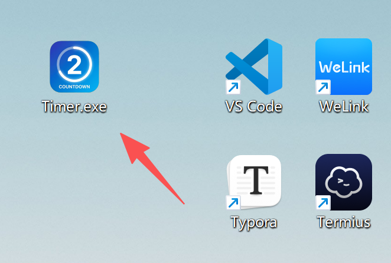
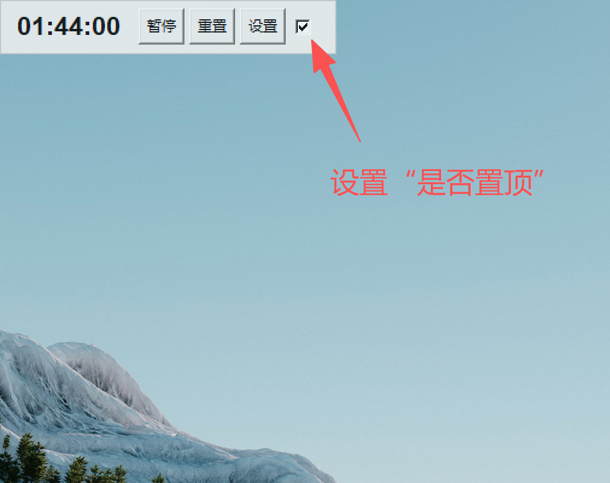
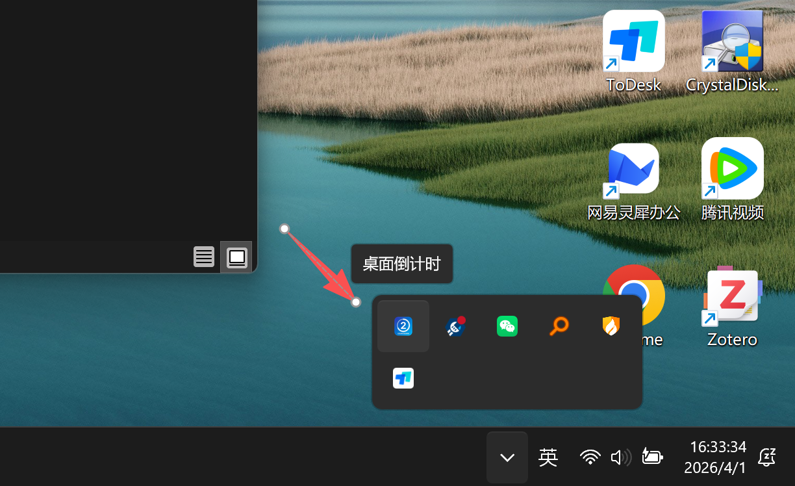

# ⏳ 桌面倒计时小工具 (Desktop Countdown Timer)

[English](README_EN.md) | [简体中文](README.md) 

这是一个基于 Python开发的轻量级桌面倒计时小部件。它具有半透明、无边框、可拖拽的特点，且运行后会自动隐藏任务栏图标，静默驻留在右下角系统托盘中，不打扰你的日常工作。

Windows环境下EXE可执行文件下载链接：[Github](https://github.com/Wucy0519/Timer/tags) | [谷歌云盘](https://drive.google.com/file/d/1K8Xy5-gPybSjm8b4Lrwx4peJPUTRuhJm/view?usp=sharing) | [百度网盘](https://pan.baidu.com/s/1KmjRVwZq6DcGX2PSPdfjJg?pwd=c3s8)

## ✨ 核心功能

* **极简视觉**：半透明无边框设计，占用屏幕空间极小。
* **自由拖拽**：按住界面空白处或时间数字即可在桌面自由移动位置。
* **灵活设置**：默认 2 小时，随时可通过“设置”按钮自定义分钟数。
* **一键置顶**：提供“置顶”选项（“置顶”字符隐藏），确保倒计时时刻可见。

## 📸 使用教程

### 1. 运行程序
你可以直接下载打包好的 `.exe` 文件并双击运行，无需配置任何 Python 环境。


### 2. 主界面与置顶功能
界面小巧直观，包含“开始/暂停”、“重置”、“设置”按钮。勾选最右侧的复选框即可让小部件保持在所有窗口的最前端（置顶）。


### 3. 系统托盘后台运行
为了保持任务栏整洁，本程序不会在底部任务栏显示图标。你可以通过 Windows 右下角的系统托盘找到它。右键点击托盘图标即可选择“显示面板”或“退出程序”。


---

## 📁 目录结构

```text
.
├── asset/                 # 存放 README 文档使用的截图与图标资源
│   ├── 0.png
│   ├── 1.png
│   └── 2.png
├── python-code/           # 存放 Python 源代码
│   ├── timer.py           # 主程序代码
│   └── logo.ico           # 托盘图标源文件
└── README.md              # 项目说明文档
```

## 打包成EXE格式

需要安装的python库：
```shell
pystray
Pillow
pyinstaller
```

请确保你的命令行路径与 `timer.py` 和 `icon.ico` 在同一个文件夹下。然后运行以下命令进行打包（以 Windows 为例）：

```shell
pyinstaller -F -w --add-data "logo.ico;." -i logo.ico timer.py
```

打包完成后，去 `dist` 文件夹里拿出生成的 `timer.exe`。此时，图标已经被完美封装在程序内部了，你可以将这个文件放在电脑的任何位置运行。

## 特此说明

禁止商用，商用请联系 chenyangwu@mail.nankai.edu.cn